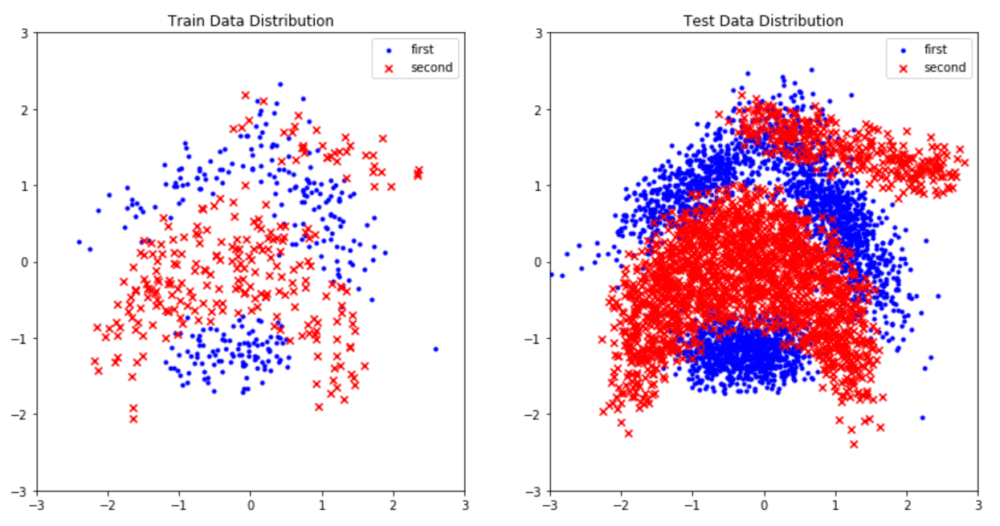
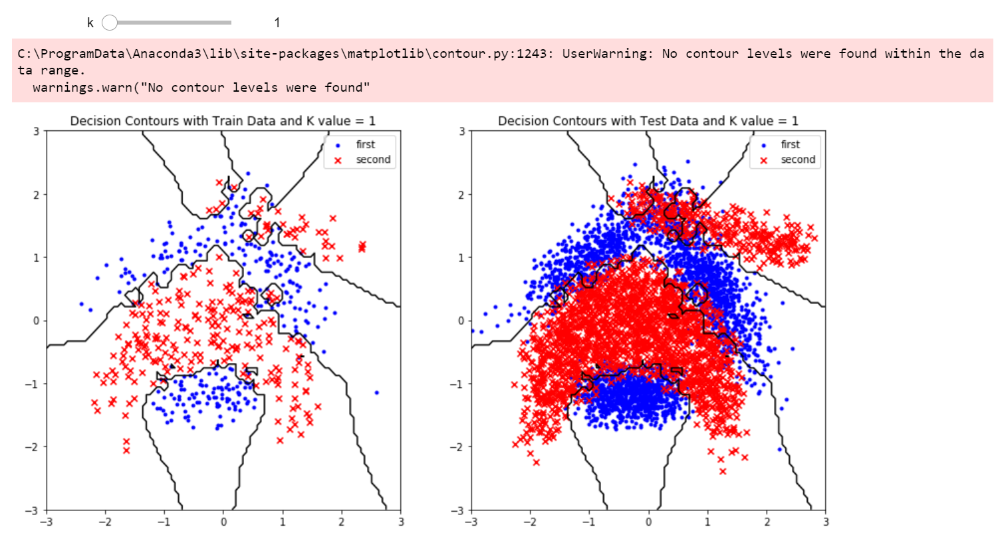
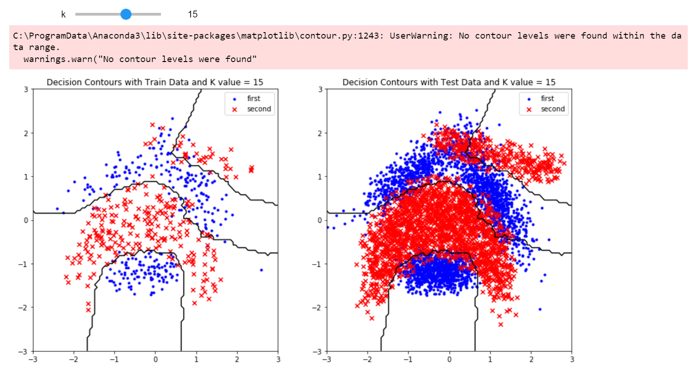
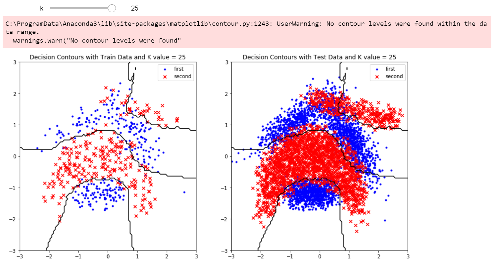
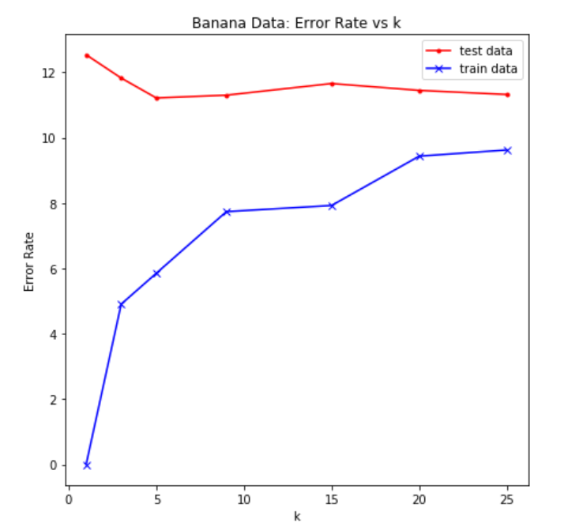

# Welcome to KNN implementation
> Download the data set from https://www.openml.org/data/v1/download/1586217/banana.arff

### Screenshots

The distribution of the data points.

The decision contours when K=1

The decision contours when K=15
 
 
The decision contours when K=25

The error rate given the value of k (ranging 1 to 25)
